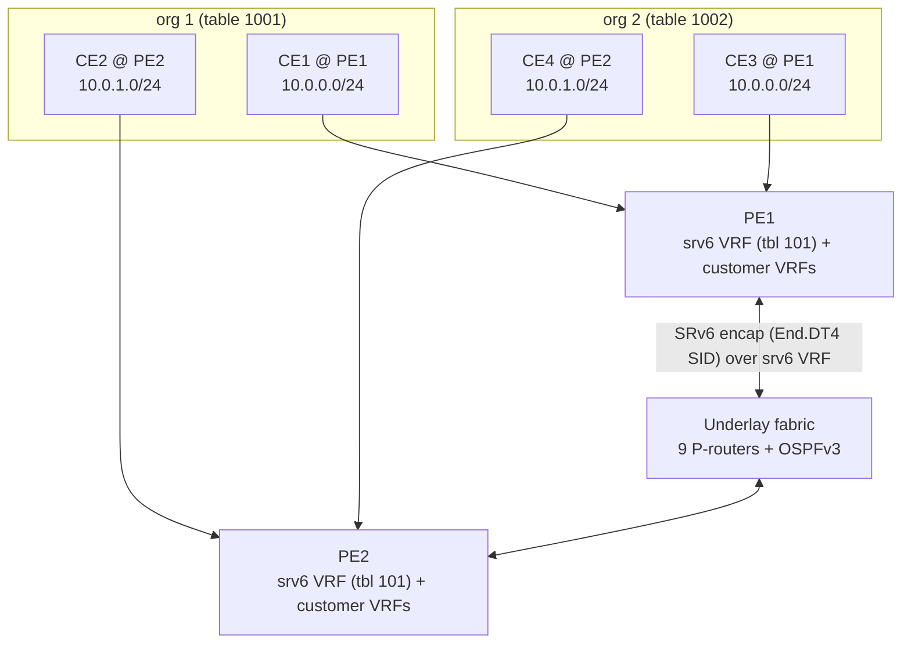
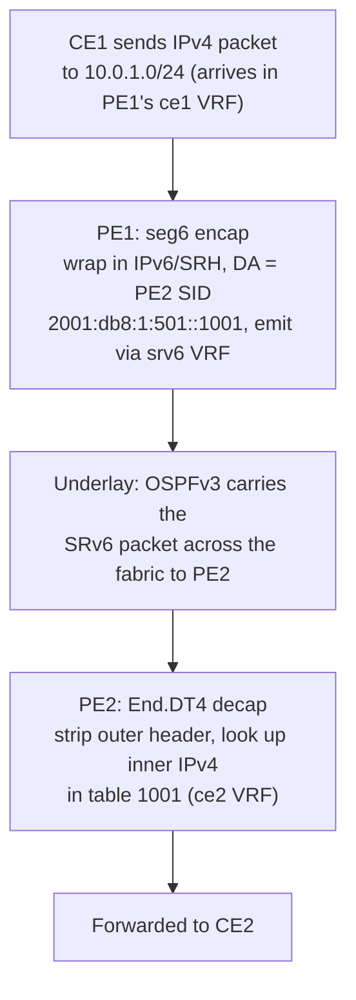

# srv6lab

A self-contained lab for experimenting with **SRv6 (Segment Routing over IPv6)**. It
builds a virtual service-provider network entirely out of Linux network namespaces and
containerized [FRRouting][frr] routers — no VMs or external hardware required — and uses
SRv6 to deliver an **IPv4 L3VPN** service on top of an **OSPFv3** underlay.

[frr]: https://frrouting.org/

The goal is the classic SRv6-VPN story: two customer organizations, each with a site on
both edges of the provider fabric, communicate through the provider using SRv6
encapsulation. The PEs act as ingress (encap) and egress (decap) SRv6 endpoints.

## Topology

```
┌──────┐      ┌────────┐    ┌──────────────────┐    ┌────────┐      ┌──────┐
│ CE1  ├──────┤        │    │                  │    │        ├──────┤ CE2  │
└──────┘      │  PE1   │    │ 3x3 P-routers    │    │  PE2   │      └──────┘
              │        ├────┤                  ├────┤        │                
              │        │    │     + OSPFv3     │    │        │              
┌──────┐      │        │    │                  │    │        │      ┌──────┐
│ CE3  ├──────┤        │    │                  │    │        ├──────┤ CE4  │
└──────┘      └────────┘    └──────────────────┘    └────────┘      └──────┘
```

CE1↔CE2 are org 1 (table 1001); CE3↔CE4 are org 2 (table 1002). Each PE SRv6-encapsulates
its sites' traffic across the OSPFv3 fabric to the other PE, which decapsulates into the
matching customer table.

## Architecture: two planes

The lab is split into an **underlay** (the provider fabric) and an **overlay** (the
customer VPNs carried over it by SRv6).



### Underlay — the provider fabric

11 routers wired together with veth pairs:

- **2 Provider-Edge (PE) routers**: `pe1`, `pe2`
- **9 Provider (P) core routers** in a 3×3 grid: `p11 p12 p13 / p21 p22 p23 / p31 p32 p33`

Each runs in its own namespace as an `frrouting/frr` container (via Podman) and speaks
OSPFv3. The connectivity is a multi-stage fabric:

```
        ┌───────┐   full mesh   ┌───────┐   full mesh   ┌───────┐
 pe1 ──▶│ col1  │ ────────────▶ │ col2  │ ────────────▶ │ col3  │◀── pe2
        │p11 p21│               │p12 p22│               │p13 p23│
        │p31    │               │p32    │               │p33    │
        └───────┘               └───────┘               └───────┘
```

- `pe1` connects to every node in column 1; `pe2` to every node in column 3.
- Every node in column *N* is fully meshed with every node in column *N+1`.
- **24 point-to-point links** in total.

### Overlay — customer L3VPN via SRv6

4 customer edges (`ce1`–`ce4`) attach to the PEs, grouped into two organizations:

| Org | VRF table | PE1 site | PE2 site |
| --- | --- | --- | --- |
| org 1 | **1001** | `ce1` — `10.0.0.0/24` | `ce2` — `10.0.1.0/24` |
| org 2 | **1002** | `ce3` — `10.0.0.0/24` | `ce4` — `10.0.1.0/24` |

The two orgs intentionally use **overlapping** IPv4 subnets (`10.0.0.0/24` on the PE1
side, `10.0.1.0/24` on the PE2 side) — they are kept separate by living in different
VRF tables.

#### How a packet crosses the fabric (CE1 → CE2)



The reverse direction (CE2 → CE1) is the mirror image, landing in PE1's table 1001.
Org 2 (CE3 ↔ CE4) is identical but uses table 1002 and the `::1002` SIDs.

## Addressing

### Underlay IPv6 locators (provider plane)

All underlay addresses live under the documentation prefix `2001:db8:1::/48`
(`domain_global`). The hextets intentionally encode **region** and **node**, which makes
them natural SRv6 locators/segments:

| Entity | Region ID | Node ID |
| --- | --- | --- |
| `pe1` | 1 | 1 |
| column 1 (`p11 p21 p31`) | 2 | row number (1–3) |
| column 2 (`p12 p22 p32`) | 3 | row number (1–3) |
| column 3 (`p13 p23 p33`) | 4 | row number (1–3) |
| `pe2` | 5 | 1 |

- **Node locator** — `<domain>:<region><node>::/64`
  e.g. `pe1` → `2001:db8:1:101::/64`, `pe2` → `2001:db8:1:501::/64`, `p22` → `2001:db8:1:302::/64`.
  On the PEs this `/64` is placed on the `srv6` VRF; on P-routers it sits on `lo`.
- **Point-to-point links** — `<domain>:<src_region><src_node>::<dst_region><dst_node>:<order>/127`,
  where the trailing `order` bit (0/1) distinguishes each end.

The `make_address` / `make_ptp_address` helpers in `02-assign-addresses.sh` compose these
by shifting the 8-bit region and node IDs into a single hextet.

### SRv6 SIDs

A SID is `<PE locator>::<function>`. The function hextet is a **mnemonic** for the
customer table the egress PE must decap-and-lookup into; the actual table is bound by the
`End.DT4 vrftable` argument, so the hextet only needs to be unique.

| SID | Belongs to | Decaps into |
| --- | --- | --- |
| `2001:db8:1:101::1001` | PE1 (org 1) | table 1001 (`ce1`) |
| `2001:db8:1:101::1002` | PE1 (org 2) | table 1002 (`ce3`) |
| `2001:db8:1:501::1001` | PE2 (org 1) | table 1001 (`ce2`) |
| `2001:db8:1:501::1002` | PE2 (org 2) | table 1002 (`ce4`) |

### Customer IPv4 (overlay plane)

- CE loopbacks use the `.4` host in their `/24` (e.g. `ce1` → `10.0.0.4/24`).
- CE↔PE interconnects are `/30`: CE side `.1`, PE side `.2`.
- Each CE uses its PE (`.2`) as its default gateway; each PE has a route to its CE's
  `/24` inside the customer VRF.

## VRF / table layout

The convention (from `00-create-netns-and-vrf.sh`) is:

- **100–999** — provider VRFs. Only `srv6` (table 101) is used: the SRv6 transport VRF on
  the PEs that holds the PE locators and runs the underlay OSPFv3.
- **1000–1999** — customer VRFs. `1001` = org 1, `1002` = org 2. Each is instantiated on
  the PE that hosts the corresponding CE (so `ce1`/`ce2` share table 1001 on opposite PEs,
  `ce3`/`ce4` share table 1002).

## The init.d / deinit.d scripts

The scripts are numbered and meant to run in order. `init.d/` brings the lab up;
`deinit.d/` tears it down.

### `init.d/` — bring up the lab

| Script | Purpose |
| --- | --- |
| `00-create-netns-and-vrf.sh` | Creates the 11 router namespaces; sets sysctls (IPv6 forwarding, `seg6_enabled`, `seg6_require_hmac=0`, VRF strict mode); creates the `srv6` VRF (table 101) on `pe1`/`pe2`. |
| `01-connect-netns.sh` | Creates the veth pairs that build the fabric topology. |
| `02-assign-addresses.sh` | Computes region/node IDs; assigns PE locators to the `srv6` VRF, P-router locators to `lo`, and `/127` point-to-point addresses. |
| `03-create-node-directories.sh` | Stages a per-node `frr.conf.d` under `nodes/<node>/` from the shared template, writing hostname + logging into `frr.conf`. |
| `04-launch-frr.sh` | Launches one `frrouting/frr:10.6.1` container per namespace via Podman, joined to its namespace (`--network ns:/run/netns/<node>`) with the relevant networking caps. |
| `05-config-frr.sh` | Configures the **OSPFv3 underlay** via `vtysh`: router-ID `<region>.<node>.0.0`, area 0 on all transit links (point-to-point) and the locator (passive). PEs run OSPF inside the `srv6` VRF; P-routers in the default table. |
| `06-ping-all.sh` | Sanity-checks underlay reachability by pinging every locator from PE1 inside the `srv6` VRF. |
| `07-create-customer-ns.sh` | Creates the `ce1`–`ce4` customer namespaces (IPv6 forwarding on). |
| `08-connect-customer-ns.sh` | Connects each CE to its PE with a veth placed in a customer VRF (tables 1001/1002); assigns IPv4 loopbacks, `/30` interconnects, CE default gateways, and PE→CE routes. |
| `09-srv6-encap.sh` | Installs the **SRv6 L3VPN**: `End.DT4` decap SIDs (`seg6local`) on each PE for tables 1001/1002, and `seg6 mode encap` routes in each customer VRF pointing at the remote PE's SID via the `srv6` VRF. |

### `deinit.d/` — tear down

| Script | Purpose |
| --- | --- |
| `07-teardown-frr.sh` | Stops the 11 `frr-<node>` core containers (launched with `--rm`, so they self-remove). |
| `08-remove-node-directories.sh` | Deletes the staged `nodes/` config tree. |
| `09-teardown-netns.sh` | Deletes the 11 core router namespaces. |
| `10-teardown-customer-netns.sh` | Delete the customers namespaces. |

## Running

```bash
# bring up (run init.d in order)
for s in init.d/*.sh; do bash "$s"; done

# tear down (run deinit.d in order), plus the customer namespaces
for s in deinit.d/*.sh; do bash "$s"; done
for ns in ce1 ce2 ce3 ce4; do ip netns del "$ns"; done
```

> Requires root (for `ip netns`/VRFs), Podman, and the `frrouting/frr:10.6.1` image.

## Verifying

```bash
# underlay: PE1 should reach PE2's locator inside the srv6 VRF
ip netns exec pe1 ip vrf exec srv6 ping -c1 2001:db8:1:501::

# CE-to-PE leg (per customer VRF)
ip netns exec pe1 ip vrf exec ce1 ping 10.0.0.4

# end-to-end across the SRv6 VPN
ip netns exec ce1 ping 10.0.1.4   # org 1: CE1 -> CE2
ip netns exec ce3 ping 10.0.1.4   # org 2: CE3 -> CE4

# inspect the SRv6 state
ip -n pe1 -6 route show table local | grep -i seg6local   # decap SIDs
ip -n pe1 route show vrf ce1                              # encap route
```

## Notes

- The base container template lives in [`frr.conf.d/`](frr.conf.d/); per-node runtime
  configs are generated under `nodes/<node>/frr.conf.d/`.
- `launch_frr.sh` is a leftover single-container launcher for a `dn42` namespace and is
  not part of the numbered init/deinit workflow.
