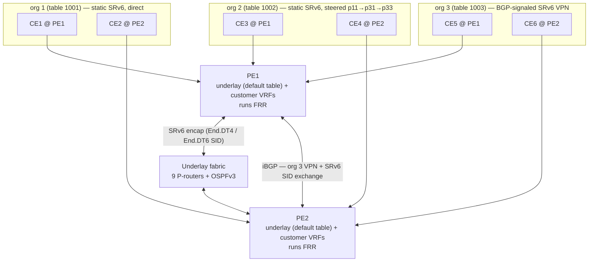
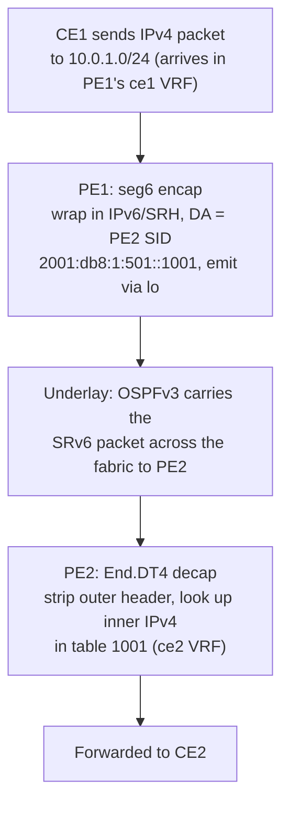

# srv6lab

A self-contained lab for experimenting with **SRv6 (Segment Routing over IPv6)**. It
builds a virtual service-provider network entirely out of Linux network namespaces and
containerized [FRRouting][frr] routers — no VMs or external hardware required — and uses
SRv6 to deliver **L3VPN** services (both IPv4 and IPv6) on top of an **OSPFv3** underlay.

[frr]: https://frrouting.org/

The lab demonstrates the SRv6-VPN story in three flavors, each a customer org split across
the two PEs:

- **Org 1** (table 1001) and **Org 2** (table 1002) — *statically programmed* SRv6: the
  `seg6local` local SIDs and the `seg6` encap routes are installed by hand. Org 1 takes a
  direct single-segment path PE1↔PE2; org 2 is traffic-engineered through specific core
  routers.
- **Org 3** (table 1003) — *BGP-signaled* SRv6 VPN: CE5/CE6 peer with the PEs over eBGP,
  the PEs exchange the VPN over iBGP, and FRR auto-allocates the SRv6 SIDs — the way a real
  operator would wire it up.

In every case the PEs act as ingress (encap) and egress (decap) SRv6 endpoints.

## Topology

The provider fabric is 11 routers: two PEs (`pe1`, `pe2`) flanking a 3×3 grid of P-routers
(`p11 p12 p13 / p21 p22 p23 / p31 p32 p33`). The OSPFv3 adjacency graph is three
PE-anchored row-chains with vertical links only between adjacent rows:

```
                        col1            col2            col3
                     +-------+       +-------+       +-------+
               +---->| p11   |------>| p12   |------>| p13   |----+
               |     +-------+       +-------+       +-------+    |
               |        |               |               |         |
   +-------+   |     +-------+       +-------+       +-------+    |   +-------+
   |  PE1  |---+---->| p21   |------>| p22   |------>| p23   |----+-->|  PE2  |
   +-------+   |     +-------+       +-------+       +-------+    |   +-------+
               |        |               |               |         |
               |     +-------+       +-------+       +-------+    |
               +---->| p31   |------>| p32   |------>| p33   |----+
                     +-------+       +-------+       +-------+

   ------>  inter-column (same row):  col c  ->  col c+1
     |      intra-column (same col):  adjacent rows only  (row r <-> row r±1)
   PE1 peers with every col-1 node; every col-3 node peers with PE2
```

## Architecture: two planes

The lab is split into an **underlay** (the OSPFv3 provider fabric, run in each router's
default table) and an **overlay** (the customer VPNs carried over it by SRv6).



### Underlay — the provider fabric

11 routers wired together with veth pairs and speaking OSPFv3 (area 0). Each router runs in
its own namespace as an `frrouting/frr` container (via Podman); the underlay lives in the
**default routing table** on every node (there is no separate transport VRF).

- Each row forms a chain `pe1 – p{r}1 – p{r}2 – p{r}3 – pe2` (inter-column, same-row links).
- Within a column, only **vertically adjacent** P-routers peer (`p{r} ↔ p{r±1}`); there is
  no skip-hop intra-column adjacency.
- `pe1` peers with every node in column 1; `pe2` with every node in column 3.

The OSPF adjacencies are configured in `05-config-frr.sh`: area 0 on every locator (`lo`,
passive) and on every transit link (`ipv6 ospf6 network point-to-point`).

### Overlay — customer L3VPN via SRv6

6 customer edges attach to the PEs, grouped into three organizations:

| Org | VRF / table | PE1 site | PE2 site | SRv6 programming |
| --- | --- | --- | --- | --- |
| org 1 | **1001** | `ce1` | `ce2` | static, direct PE1↔PE2 |
| org 2 | **1002** | `ce3` | `ce4` | static, steered `p11→p31→p33` |
| org 3 | **1003** | `ce5` | `ce6` | BGP-signaled (FRR, auto SIDs) |

Each org is carried in **both** IPv4 and IPv6. The orgs intentionally use **overlapping**
address space — they are kept separate by living in different VRF tables:

| Plane | PE1 side | PE2 side |
| --- | --- | --- |
| IPv4 | `10.0.0.0/24` | `10.0.1.0/24` |
| IPv6 | `fd00:1::/48` | `fd00:1:1::/48` |

`ce1`–`ce4` are plain Linux namespaces; `ce5` and `ce6` also run FRR (for the BGP peering).

#### How a packet crosses the fabric (CE1 → CE2, org 1, IPv4)



The IPv6 overlay (CE1 ↔ CE2) is the mirror image using the `End.DT6` SID
(`2001:db8:1:501:2::1001`). The reverse direction lands in PE1's table 1001.

Org 2 (CE3 ↔ CE4) reaches the same result but is **traffic-engineered through the P
fabric**: its SRH lists transit `End` SIDs (`p11 → p31 → p33`) before the remote PE's
`End.DT4`/`End.DT6`, steering the packet across specific core routers instead of going
direct.

Org 3 (CE5 ↔ CE6) does no manual SRv6 at all: CE5/CE6 advertise their prefixes to the PEs
over eBGP (AS65001), the PEs (AS65002) exchange the VPN routes over iBGP, and FRR
auto-allocates the SRv6 SIDs from each PE's `locator main`.

## Addressing

### Underlay IPv6 locators (provider plane)

Underlay addresses live under two documentation prefixes, both composed from an 8-bit
**region** and 8-bit **node** ID, which makes them natural SRv6 locators/segments.

| Entity | Region ID | Node ID |
| --- | --- | --- |
| `pe1` | 1 | 1 |
| column 1 (`p11 p21 p31`) | 2 | row number (1–3) |
| column 2 (`p12 p22 p32`) | 3 | row number (1–3) |
| column 3 (`p13 p23 p33`) | 4 | row number (1–3) |
| `pe2` | 5 | 1 |

- **Node locator** — `2001:db8:1:<region><node>::/64` (`domain_global`), placed on `lo` on
  every router.
  e.g. `pe1` → `2001:db8:1:101::/64`, `pe2` → `2001:db8:1:501::/64`, `p22` → `2001:db8:1:302::/64`.
- **Point-to-point links** — `2001:db8:1:<src_region><src_node>::<dst_region><dst_node>:<order>/127`,
  where the trailing `order` bit (0/1) distinguishes each end.
- **PE SRv6/BGP-locator plane** — `2001:db8:2:<region><node>::/64` (`domain_sid`), also on
  the PE loopbacks. e.g. `pe1` → `2001:db8:2:101::/64`, `pe2` → `2001:db8:2:501::/64`. This
  is the iBGP transport between PEs and the `locator main` prefix used by org 3's BGP VPN.

The `make_address` / `make_ptp_address` helpers in `02-assign-addresses.sh` compose these
by shifting the 8-bit region and node IDs into a single hextet.

### SRv6 SIDs

A SID is a 128-bit IPv6 address laid out as **64-bit locator + 16-bit function code +
48-bit argument**.

- **Locators (64 bits)** — the node that owns the SID:
  - PE locators `2001:db8:1:101` (`pe1`) and `2001:db8:1:501` (`pe2`), on `lo`;
  - P-router locators `2001:db8:1:<region><node>` (e.g. `p11` → `2001:db8:1:201`), on `lo`.
- **Function codes (16 bits)** — the SRv6 behavior. Three are used:
  - `0` → **`End.DT4`** on the egress PE: decap the inner IPv4 and look it up in a customer VRF;
  - `1` → **`End`** on every transit P-router: pop the SRH active segment and forward to the next;
  - `2` → **`End.DT6`** on the egress PE: decap the inner IPv6 and look it up in a customer VRF.
- **Arguments (48 bits)** — a per-function parameter:
  - `End.DT4` / `End.DT6` → the **target customer table id** (`0x1001`/`0x1002`, written as
    the trailing hextet `1001`/`1002`) carried as a mnemonic; the real binding comes from the
    `End.DT4 vrftable` / `End.DT6 vrftable` argument, so the value only needs to be unique;
  - `End` → `0` (unused).

The **statically programmed** SIDs (orgs 1 & 2, installed in `09`/`10`):

| SID | Locator | Function | Argument |
| --- | --- | --- | --- |
| `2001:db8:1:101::1001` | pe1 | `0` `End.DT4` | `0:0:1001` → table 1001 (`ce1`) |
| `2001:db8:1:101::1002` | pe1 | `0` `End.DT4` | `0:0:1002` → table 1002 (`ce3`) |
| `2001:db8:1:501::1001` | pe2 | `0` `End.DT4` | `0:0:1001` → table 1001 (`ce2`) |
| `2001:db8:1:501::1002` | pe2 | `0` `End.DT4` | `0:0:1002` → table 1002 (`ce4`) |
| `2001:db8:1:101:2::1001` | pe1 | `2` `End.DT6` | `0:0:1001` → table 1001 (`ce1`) |
| `2001:db8:1:101:2::1002` | pe1 | `2` `End.DT6` | `0:0:1002` → table 1002 (`ce3`) |
| `2001:db8:1:501:2::1001` | pe2 | `2` `End.DT6` | `0:0:1001` → table 1001 (`ce2`) |
| `2001:db8:1:501:2::1002` | pe2 | `2` `End.DT6` | `0:0:1002` → table 1002 (`ce4`) |
| `2001:db8:1:<reg><row>:1::` | every P | `1` `End` | `0` |

Every P-router gets an `End` SID; only `p11`, `p31`, `p33` are placed in org 2's segment
list. Org 3's SIDs are not listed here — they are auto-allocated by FRR under each PE's
`locator main` (`2001:db8:2:101` / `2001:db8:2:501`).

### Customer addressing (overlay plane)

Per-org addressing (identical across the three orgs since they live in separate tables):

- **IPv4** — CE loopback carries the whole `/24` on `lo` (`10.0.0.0/24` on the PE1 side,
  `10.0.1.0/24` on the PE2 side). The CE↔PE interconnect is a `/30`: CE side `.1`, PE side
  `.2`; the CE uses the PE (`.2`) as its default gateway and the PE holds a route to the
  CE's `/24` inside the customer VRF.
- **IPv6** — CE loopback carries the whole `/48` on `lo` (`fd00:1::/48` on the PE1 side,
  `fd00:1:1::/48` on the PE2 side). The interconnect is a `/127`, again with the PE as the
  CE's default gateway.

## VRF / table layout

The convention (from `00-create-netns-and-vrf.sh` and `08-connect-customer-ns.sh`) is:

- **1001–1999** — customer VRFs, one per org, instantiated on the PE that hosts the
  corresponding CE:
  - `1001` = org 1 (`ce1` on pe1, `ce2` on pe2);
  - `1002` = org 2 (`ce3` on pe1, `ce4` on pe2);
  - `1003` = org 3 (`ce5` on pe1, `ce6` on pe2).
- The underlay runs in the **default table** on every router; there is no dedicated
  transport/srv6 VRF. (The `00-create-netns-and-vrf.sh` filename predates that change.)

## The init.d / deinit.d scripts

The scripts are numbered and meant to run in order. `init.d/` brings the lab up;
`deinit.d/` tears it down.

### `init.d/` — bring up the lab

| Script | Purpose |
| --- | --- |
| `00-create-netns-and-vrf.sh` | Creates the 11 router namespaces (`pe1`, `p11`–`p33`, `pe2`) **and** the 6 customer namespaces (`ce1`–`ce6`); sets sysctls on each (IPv6 forwarding, VRF strict mode, `seg6_enabled`, `seg6_require_hmac=0`, `keep_addr_on_down`). Despite the name, it no longer creates any VRF. |
| `01-connect-netns.sh` | Creates the veth pairs that build the fabric (inter-column links plus the PE↔column-1 / column-3↔PE links). |
| `02-assign-addresses.sh` | Computes region/node IDs; assigns the `2001:db8:1::` locators to every `lo`, the `/127` point-to-point addresses, and the `2001:db8:2::` PE SRv6/BGP-locator prefixes. |
| `03-create-node-directories.sh` | Stages a per-node `frr.conf.d` under `nodes/<node>/` from the shared template for the 13 FRR-running nodes (`pe1`, `p11`–`p33`, `pe2`, `ce5`, `ce6`), writing hostname + logging into `frr.conf`. |
| `04-launch-frr.sh` | Launches one `frrouting/frr:10.6.1` container per FRR node via Podman, joined to its namespace (`--network ns:/run/netns/<node>`) with the relevant networking caps. |
| `05-config-frr.sh` | Configures the **OSPFv3 underlay** via `vtysh`: router-ID `<region>.<node>.0.0`, area 0 on every locator (`lo`, passive) and on every transit link (point-to-point), all in the default table. Adjacencies follow the row-chain + adjacent-row topology above. |
| `08-connect-customer-ns.sh` | Connects `ce1`–`ce6` to their PE inside customer VRFs (tables 1001/1002/1003); assigns IPv4 (`10.0.x`) and IPv6 (`fd00:1:...`) loopbacks, `/30` and `/127` interconnects, CE default gateways, and PE→CE routes. No static route is added for `ce5`/`ce6` (learned via BGP). |
| `09-programming-srv6-dataplane.sh` | Programs the SRv6 **data plane (local SIDs)** for orgs 1 & 2: installs `End.DT4` and `End.DT6` decap SIDs (`seg6local`) on each PE for tables 1001/1002, and an `End` SID on every transit P-router so traffic-engineered paths can steer through it. |
| `10-setup-pe-srv6-routes.sh` | Installs the **ingress encap routes** in the customer VRFs (`seg6 mode encap … dev lo`/`v-<node>`): org 1 is a direct single-segment path PE1↔PE2, while org 2 is steered through the P fabric (`p11 → p31 → p33`) via the transit `End` SIDs before the remote PE's decap SID. Covers both IPv4 (`End.DT4`) and IPv6 (`End.DT6`). |
| `11-add-bgp-ce.sh` | Brings up **org 3's BGP-signaled SRv6 VPN**: eBGP from `ce5`/`ce6` (AS65001) to their PE (AS65002), iBGP between PE1 and PE2 over the `2001:db8:2::` locators, with `segment-routing srv6` + `locator main` so FRR auto-allocates the VPN SIDs (RD/RT `65001:1003`). |

> There is no `06-*` or `07-*` script in `init.d/`; those numbers are skipped.

### `deinit.d/` — tear down

| Script | Purpose |
| --- | --- |
| `07-teardown-frr.sh` | Stops the 13 `frr-<node>` containers (`pe1`, `p11`–`p33`, `pe2`, `ce5`, `ce6`; launched with `--rm`, so they self-remove). |
| `08-remove-node-directories.sh` | Deletes the staged `nodes/` config tree. |
| `09-teardown-netns.sh` | Deletes all 17 namespaces — the 11 routers and `ce1`–`ce6`. |

## Running

```bash
# bring up (run init.d in order)
for s in init.d/*.sh; do bash "$s"; done

# tear down (run deinit.d in order)
for s in deinit.d/*.sh; do bash "$s"; done
```

> Requires root (for `ip netns`/VRFs), Podman, and the `frrouting/frr:10.6.1` image.

## Verifying

```bash
# underlay: PE1 should reach PE2's locator (default table, no VRF)
ip netns exec pe1 ping -c1 2001:db8:1:501::

# CE-to-PE leg (per customer VRF)
ip netns exec pe1 ip vrf exec ce1 ping 10.0.0.1

# end-to-end across the SRv6 VPN (ping the far CE's PE-side interconnect)
ip netns exec ce1 ping 10.0.1.1   # org 1: CE1 -> CE2  (static SRv6, direct)
ip netns exec ce3 ping 10.0.1.1   # org 2: CE3 -> CE4  (static SRv6, steered)
ip netns exec ce5 ping 10.0.1.1   # org 3: CE5 -> CE6  (BGP-signaled, after convergence)

# IPv6 overlay
ip netns exec ce1 ping fd00:1:1::1

# inspect the SRv6 state
ip -n pe1 -6 route show table local | grep -i seg6local   # decap SIDs
ip -n pe1 route show vrf ce1                              # encap route
```

## Tests

The [`test/`](test/) directory holds scripted checks meant to be run **after** the
`init.d/` scripts have brought the lab up. They sanity-check the underlay and exercise the
SRv6 data plane (including the BGP-signaled VPN), and the second one demonstrates SRv6
inline-mode traffic steering on top of the fabric.

```bash
# run the whole test suite in order
for s in test/*.sh; do bash "$s"; done
```

### `test/01-ping-all.sh` — underlay + SRv6 reachability

- **Underlay.** From `pe1` (default table, no VRF), pings every router locator — `pe1`,
  `pe2`, and all nine P-routers (`2001:db8:1:<reg><node>::`).
- **Static SRv6 encap (orgs 1 & 2).** `ce1 → 10.0.1.4` and `ce3 → 10.0.1.4` (IPv4), plus
  `ce1 → fd00:1:1::` and `ce3 → fd00:1:1::` (IPv6), each for 10 packets. Org 1 takes the
  direct PE1↔PE2 path; org 2 is steered `p11 → p31 → p33`.
- **BGP-signaled L3VPN (org 3).** `ce5 → 10.0.1.4` (IPv4) and `ce5 → fd00:1:1::` (IPv6),
  3 packets each — verifying CE5↔CE6 reachability once the iBGP/eBGP VPN has converged.

The targets `10.0.1.4` / `fd00:1:1::` are just hosts inside the far site's prefixes
(`10.0.1.0/24`, `fd00:1:1::/48`), which the far CE carries in full on its loopback, so the
same address works for all three orgs (each lands in its own table: ce2, ce4, or ce6).

### `test/02-traffic-steering.sh` — SRv6 inline-mode steering

A standalone demo that adds its **own** steering route on `pe1`, separate from the
encap-mode routes installed by `init.d/10-setup-pe-srv6-routes.sh`.

1. Adds a temporary source address `2001:db8:3:101::/64` to `pe1`'s `lo` and waits for
   OSPF to propagate it.
2. **Baseline:** `ping -c20` and `traceroute` from `2001:db8:3:101::` to `pe2`'s locator
   (`2001:db8:1:501::`) — observe the default IGP path and latency.
3. Installs a policy rule (`from 2001:db8:3:101::/64 lookup 1001`) and a **`seg6 mode
   inline`** route in table 1001 toward `2001:db8:1:501::/64` whose segment list is
   `p11 → p32 → p13` (`2001:db8:1:201:1::, 2001:db8:1:303:1::, 2001:db8:1:401:1::`, via
   `v-p11`). Inline mode injects an SRH next-header so the source address alone selects
   this path.
4. Re-runs the `ping`/`traceroute` to show the now-steered forwarding path (different
   hops/latency than the baseline).

## Notes

- The base container template lives in [`frr.conf.d/`](frr.conf.d/); per-node runtime
  configs are generated under `nodes/<node>/frr.conf.d/`.
- `launch_frr.sh` is a leftover single-container launcher for a `dn42` namespace and is
  not part of the numbered init/deinit workflow.
